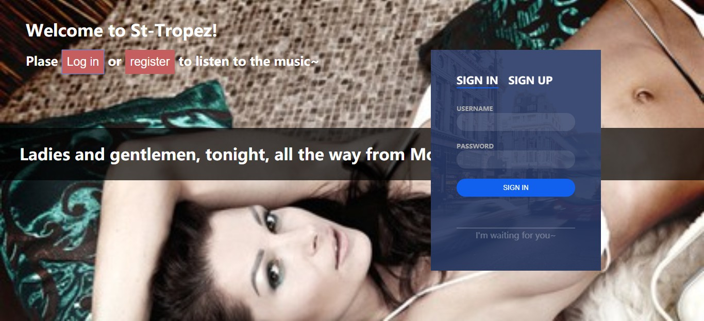
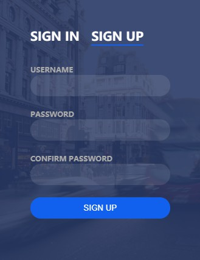

# cookie 与 node 模拟登录注册
## 准备工作：
1. 做一个所有人都可以看到的页面，并有点击可见的登录框与注册框
2. 用户所有数据保存在 db.json（模拟数据库）


## 步骤：
1. 前端获取用户注册数据并做初次验证，将数据ajax发给后台
```js
$.post("/sign_up", hash).then((res) => {...}, (err) => {...})
```

2. 后台第一次将数据保存在数据库，并给用户响应
```js
//  读取数据体
readBody(request).then((body) => { //body:name=1&pass=1&confirmPass=1
    let strings = body.split('&');
    let hash = {}
    strings.forEach((string) => {
        let parts = string.split('=')
        let key = parts[0]
        let value = parts[1]
        hash[key] = decodeURIComponent(value)
    })
    let {name,pass} = hash
    let users = fs.readFileSync('./db', 'utf8');
    users = JSON.parse(users) || [];
    users.push({name,pass});
    // 保存数据
    fs.writeFileSync('./db',JSON.stringify(users));
});

// 响应
response.setHeader('Content-Type', 'text/json;charset=utf-8')
response.write(`{"status":"success"}`)
```
3. 用户获取响应，成功则转入登录框，失败则重新注册 
```js
$.post("/sign_up", hash).then((res) => {
    if (res.status === 'success') {
        alert('Successful registration, please login!');
        ...
    } else {
        alert("Registration failed. Please register again!");
        ...
    }
  }, (err) => {console.log('err')})
}
```

4. 用户登录，前端获取用户登录数据并做初次验证，将数据ajax发给后台，后台将数据库的数据与当前数据作对比，
并给用户响应，此外，对比成功设置相关cookie
```js
// 读取数据体
readBody(request).then((body) => {
    let strings = body.split('&');
    let hash = {}
    strings.forEach((string) => {
        let parts = string.split('=')    
        let key = parts[0]
        let value = parts[1]
        hash[key] = decodeURIComponent(value)
    })
    let { name,pass} = hash;
    var flag = false;   
    let users = fs.readFileSync('./db', 'utf8');
    users = JSON.parse(users) || [];
    // 判断登录数据
    for (let i = 0; i < users.length; i++) {
        if (users[i].name === name && users[i].pass === pass) {  
           flag = true; break;
        }
    }
    
    // 响应
    response.setHeader('Content-Type', 'text/json;charset=utf-8');
    if (flag) {    
        // 设置 cookie
        response.setHeader('Set-Cookie', `sign_in_name=${name}`)
        response.statusCode = 200;
        response.write(`{"status":"success"}`);
    } else {
        response.statusCode = 401;
        response.write(`{"status":"fail"}`);
    }    
    response.end()
});
```

5. 用户获取响应，成功则刷新转到用户页面，失败则重新登录
```js
$.post("/sign_in", hash).then((res) => {
  if (res.status === 'success') {
    $(myForm).hide();
  } else {
    ...
  }
}, (err) => {})

// 此时获取index.html时，后台的工作
let cookie = request.headers.cookie;
// 假设存储的比较简单
let [key,name] = [cookie.split("=")[0],cookie.split("=")[1]]
string = string.replace('__personName___', name);

```
```js
// 刷新进入用户页面
if (path === '/') {
    let string = fs.readFileSync('./index.html', 'utf8');
    if (request.headers.cookie) {
        let cookie = request.headers.cookie;
        // 简单验证
        if (cookie.split('=')[0] === 'sign_in_name') {
            let name = cookie.split('=')[1]
            string = string.replace('__personName___', name);
        }
    }
    // ...
    response.statusCode = 200
    response.setHeader('Content-Type', 'text/html;charset=utf-8')
    response.write(string)
    response.end();
} 
```
6. 为防止用户再次注册 的情况，在用户注册时添加验证是否存在该用户
```js
let inUse = false;
for (let i = 0; i < users.length; i++) {
    let user = users[i]
    if (user.name === name) {
        inUse = true
        break;
    }
}
if(inUse){...}else{...}
```

7. 当用户再次打开页面时，就会根据cookie展示用户页面，如果当前电脑没有cookie,需要重新登录

### Project Screenshots

1. 所有人都可以看到的


2. 登录页面



3. 注册



4. 用户页(emmmm...实际要快很多) 登录后就可以听歌呦 DJ Monaco - Welcome to St. Tropez (Radio Edit)


# 使用
## 启动应用
```
node server 8888
```

## 添加路由
打开 server.js，添加 if else

重新运行 node server.js 8888